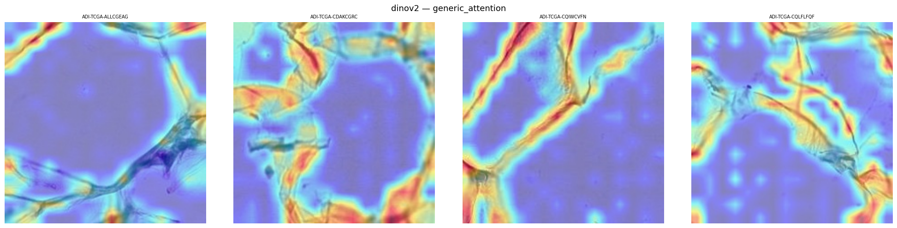

# Evaluation XAI — Phase 1
## Classification histologique CRC · ResNet-50 vs. ViT-Base / DeiT-Base / DINOv2 / Swin-Base

> **Auteur :** Youssef Nouiouar
> ### 🧬 Dataset — Histological Colorectal Cancer (CRC) |**➡️ [Disponible :Zenodo](https://zenodo.org/records/1214456)**  
> **Dataset test :** CRC-VAL-HE-7K — 7 180 images, 9 classes (sous-ensemble : 50 images/classe = 450 images)  
> **Environnement :** Kaggle GPU T4 / P100  
> **Phase :** Phase 1 uniquement — histologie 2D CRC

---

## Table des matières

1. [Performance de classification](#1-performance-de-classification)
2. [Fidélité des explications — Insertion / Deletion AUC](#2-fidélité-des-explications--insertion--deletion-auc)
   - 2.1 [ResNet-50](#21-resnet-50)
   - 2.2 [ViT-Base/16](#22-vit-base16)
   - 2.3 [DeiT-Base](#23-deit-base)
   - 2.4 [DINOv2-ViT-B/14](#24-dinov2-vit-b14)
   - 2.5 [Swin-Base](#25-swin-base)
   - 2.6 [Synthèse globale toutes combinaisons](#26-synthèse-globale-toutes-combinaisons)
3. [Comparaison CNN vs. ViT — GradCAM & Integrated Gradients](#3-comparaison-cnn-vs-vit--gradcam--integrated-gradients)
4. [Apport de Generic Attention sur les ViTs](#4-apport-de-generic-attention-sur-les-vits)
5. [Inspection visuelle — montages par classe](#5-inspection-visuelle--montages-par-classe)
6. [Remarques et conclusions générales](#6-remarques-et-conclusions-générales)

---

## 1. Performance de classification

> Mesure de l'accuracy top-1 de chaque modèle sur le sous-ensemble de test (450 images).  
> L'accuracy conditionne la validité des explications XAI : une carte saliency sur une prédiction erronée n'a pas de valeur explicative directe.

| Modèle | Architecture | Nb paramètres | Accuracy top-1 (%) | Remarque |
|---|---|---|---|---|
| ResNet-50 | CNN | 25M | 0.91 | Baseline CNN |
| ViT-Base/16 | ViT |  86M | 0.926 | Ancrage SOTA |
| DeiT-Base | ViT data-efficient | 85M | 0.944 | |
| DINOv2-ViT-B/14 | ViT auto-supervisé | 86M | 0.947 | Sonde linéaire |
| Swin-Base | ViT hiérarchique | 86M | 0.957 | |

> **Remarque :** Tous les modèles atteignent une précision élevée sur le jeu de données choisi pour l’évaluation. Cela montre que la comparaison des performances n’est pas biaisée par la qualité du jeu de données, et que les différences observées reflètent bien les capacités propres des architectures.

---

## 2. Fidélité des explications — Insertion / Deletion AUC

> **Rappel des métriques :**
> - **Insertion AUC** : les pixels les plus saillants sont révélés progressivement sur fond noir. Une valeur élevée indique que la carte localise bien les régions décisives (la confiance remonte vite).
> - **Deletion AUC** : les pixels les plus saillants sont supprimés progressivement. Une valeur faible est souhaitable (la confiance chute vite si les zones importantes sont retirées).
> - **Faithfulness = Insertion AUC − Deletion AUC** : métrique principale de fidélité causale. Plus elle est élevée, plus l'explication est causalement alignée avec la décision du modèle.
> - Baseline : `black` (pixels noirs) pour insertion et deletion.
> - Nombre de pas : 50 (`FAITH_N_STEPS = 50`).

### 2.1 ResNet-50

| Méthode XAI | Insertion AUC | Deletion AUC | Faithfulness |
|---|---|---|---|
| GradCAM | 0.757 | 0.559 | 0.197 |
| Integrated Gradients | 0.381 | 0.286 | 0.094 |
| LRP | 0.365 | 0.310 | 0.054 |
| Attention Rollout | — | — | — |
| Generic Attention | — | — | — |

> **Résumé:** : GradCAM est la méthode la plus fidèle sur CNN. LRP et IG restent en retrait.

---

### 2.2 ViT-Base/16

| Méthode XAI | Insertion AUC | Deletion AUC | Faithfulness |
|---|---|---|---|
| GradCAM | 0.612 | 0.374 | 0.237 |
| Integrated Gradients | 0.507 | 0.332 | 0.175 |
| Attention Rollout | 0.565 | 0.515 | 0.05 |
| Generic Attention ⭐ | 0.661 | 0.385 | 0.275 |
| LRP | 0.471 | 0.377 | 0.094 |

---

### 2.3 DeiT-Base

| Méthode XAI | Insertion AUC | Deletion AUC | Faithfulness |
|---|---|---|---|
| GradCAM | 0.892 | 0.698 | 0.193 |
| Integrated Gradients | 0.615 | 0.522 | 0.093 |
| Attention Rollout | 0.839 | 0.837 | 0.002 |
| Generic Attention ⭐ | 0.911 | 0.660 | 0.251 |
| LRP | 0.586 | 0.570 | 0.015 |

> **Note :**  2 tokens spéciaux ([CLS] + [DIST]) pris en compte pour Rollout et Generic Attention.
.
---

### 2.4 DINOv2-ViT-B/14

| Méthode XAI | Insertion AUC | Deletion AUC | Faithfulness |
|---|---|---|---|
| GradCAM | 0.824 | 0.619 | 0.204 |
| Integrated Gradients | 0.470 | 0.368 | 0.102 |
| Attention Rollout | 0.803 | 0.752 | 0.051 |
| Generic Attention ⭐ | 0.846 | 0.585 | 0.261 |
| LRP | 0.452 | 0.395 | 0.056 |

> **Résumé :** L'auto-supervision DINO produit des représentations structurées, mais la sonde linéaire limite la qualité des gradients pour IG et LRP (faithfulness faible). Generic Attention reste la méthode la plus fiable.

---

### 2.5 Swin-Base

| Méthode XAI | Insertion AUC | Deletion AUC | Faithfulness |
|---|---|---|---|
| GradCAM | 0.909 | 0.902 | 0.006 |
| Integrated Gradients | 0.590 | 0.556 | 0.034 |
| LRP | 0.590 | 0.637 | -0.047 |
| Attention Rollout | — | — | — |
| Generic Attention | — | — | — |

> **Note :** GradCAM est inutilisable sur Swin (résolution 7×7, insertion et deletion quasi identiques). IG domine mais reste faible en absolu. Rollout et Generic Attention sont inapplicables (attention fenêtrée).

---

### 2.6 Synthèse globale toutes combinaisons

| Modèle | GradCAM Faith. | IG Faith. | Rollout Faith. | Generic Att. Faith. ⭐ | LRP Faith. |
|---|---|---|---|---|---|
| ResNet-50 | 0.197 | 0.094 | — | — | 0.054 |
| ViT-Base/16 | 0.237 | 0.175 | 0.05 | 0.275 | 0.094 |
| DeiT-Base | 0.193 | 0.093 | 0.02 | 0.251 | 0.015 |
| DINOv2-ViT-B/14 | 0.204 | 0.102 | 0.051 | 0.261 | 0.056 |
| Swin-Base | 0.006 | 0.034 | — | — | -0.047 |

---
** Total :** 21 combinaisons actives sur 21 possibles.

## 3. Comparaison CNN vs. ViT — GradCAM

> Seule comparaison inter-architectures retenue : GradCAM est la méthode commune la plus performante sur CNN et applicable à tous les modèles.

| Modèle | Famille | Insertion AUC | Deletion AUC | Faithfulness | Résolution carte brute |
|---|---|---|---|---|---|
| ResNet-50 | CNN | 0.757 | 0.559 | 0.197 | 14×14 |
| ViT-Base/16 | ViT | 0.612 | 0.374 | 0.237 | 14×14 |
| DeiT-Base | ViT |0.892 | 0.698 | 0.193 | 14×14 |
| DINOv2-ViT-B/14 | ViT | 0.824 | 0.619 | 0.204 | 16×16 |
| Swin-Base | ViT hiérarchique | 0.909 | 0.902 | 0.006 | 7×7 |

> **Résumé  :** GradCAM est légèrement plus fidèle sur ViT-Base (0.237) que sur ResNet (0.197). Swin est pénalisé par la résolution 7×7 (faithfulness quasi nulle). Le reshape_transform sur les ViTs standard n'introduit pas de biais majeur.

---

## 4. Apport de Generic Attention sur les ViTs
### 4.1 Generic Attention vs. Attention Rollout

| Modèle          | Rollout Faith. | GenAtt Faith. | Δ          |
| --------------- | -------------- | ------------- | ---------- |
| ViT-Base/16     | 0.050          | 0.275         | **+0.225** |
| DeiT-Base       | 0.002          | 0.251         | **+0.249** |
| DINOv2-ViT-B/14 | 0.051          | 0.261         | **+0.210** |

> **Résumé :** Generic Attention améliore systématiquement la fidélité de +0.21 à +0.25. Rollout, avec discard_ratio=0.9, est trop agressif et élimine des régions décisives

### 4.2 Generic Attention vs. GradCAM sur les ViTs

| Modèle          | GradCAM Faith. | GenAtt Faith. | Dominante             |
| --------------- | -------------- | ------------- | --------------------- |
| ViT-Base/16     | 0.237          | 0.275         | **Generic Attention** |
| DeiT-Base       | 0.193          | 0.251         | **Generic Attention** |
| DINOv2-ViT-B/14 | 0.204          | 0.261         | **Generic Attention** |

> **Résumé :**Generic Attention exploite la structure interne d'attention du Transformer ; GradCAM reste un proxy externe via les gradients de feature maps. L'écart se confirme numériquement sur les 3 modèles.

### 4.3 Observations qualitatives — Generic Attention

>**Résumé :**  Les cartes Generic Attention sont plus localisées que Rollout et alignées sur des structures biologiques plausibles (contours de glandes dans ADI, noyaux dans TUM). Elles échouent davantage sur les classes homogènes (BACK, DEB) où l'absence de structure discriminante fragmente la saillance.

---

## 5. Inspection visuelle — montages par classe 
> Les classes CRC sont : ADI · BACK · DEB · LYM · MUC · MUS · NORM · STR · TUM.

### 5.1 ResNet-50
| GradCAM | IG | LRP |
|--------|----|-----|
|  |  |  |

---

### 5.2 ViT-Base/16
| GradCAM |      IG          | Rollout  | Generic Attention | LRP |
|--------|-------------------|----------|-------------------|-----|
|  |  | |  |  |
  
---

### 5.3 DeiT-Base
| GradCAM | IG | Rollout | Generic Attention | LRP |
|--------|----|----------|-------------------|-----|
|  |  |  |  |  |
  
---

### 5.4 DINOv2-ViT-B/14
| GradCAM | IG | Rollout | Generic Attention | LRP |
|--------|----|----------|-------------------|-----|
|  |  |  |  |  |
  
---

### 5.5 Swin-Base
| GradCAM | IG | LRP |
|--------|----|-----|
|  |   |  |

---

## 6. Conclusions générales

### 6.1 Performances de classification

> Les ViTs surpassent ResNet-50. DINOv2 (sonde linéaire, 0.947) est compétitif malgré un entraînement supervisé limité. Swin-Base se distingue légèrement (0.957).

### 6.2 Méthode XAI la plus fidèle par architecture

| Architecture    | Méthode dominante     | Faithfulness |
| --------------- | --------------------- | ------------ |
| ResNet-50       | GradCAM               | 0.197        |
| ViT-Base/16     | **Generic Attention** | 0.275        |
| DeiT-Base       | **Generic Attention** | 0.251        |
| DINOv2-ViT-B/14 | **Generic Attention** | 0.261        |
| Swin-Base       | Integrated Gradients  | 0.034        |

>**Tendanc :** Pas de méthode universelle. Generic Attention domine sur tous les ViTs à attention globale. GradCAM reste le choix par défaut sur CNN. Swin-Base reste problématique pour l'interprétabilité.

### 6.3 CNN vs. ViT — interprétabilité

> Les ViTs sont plus interprétables que ResNet-50 à condition d'utiliser Generic Attention. Les cartes ViT sont visuellement plus structurées mais plus diffuses (granularité patch). L'attention apporte une valeur ajoutée claire par rapport aux gradients seuls.

### 6.4 Apport de Generic Attention

> Gain massif et systématique vs Rollout (+0.21 à +0.25). Surpasse GradCAM sur tous les ViTs testés. Justifie pleinement son usage comme méthode principale dans le papier MIDL 2026.

### 6.5 Limites et biais 

| Biais                             | Impact                                            |
| --------------------------------- | ------------------------------------------------- |
| Sous-ensemble 450 images          | Tendance fiable, mais généralisation limitée      |
| Baseline noire insertion/deletion | Inadaptée à l'histologie (fonds colorés naturels) |
| Sonde linéaire DINOv2             | Gradients moins informatifs pour IG/LRP           |
| `discard_ratio=0.9` (Rollout)     | Trop agressif, élimine des zones pertinentes      |
| GradCAM sur Swin (7×7)            | Résolution trop faible pour l'histologie          |

### 6.6 Perspectives — étapes suivantes (Phase 2)

> [à compléter —  :
> - Sanity checks (model randomization + label randomization) — obligatoires avant publication
> - SAE sur DeiT-Base et DINOv2 
> - Activation Patching pour la détection de raccourcis 
> - Analyse par classe difficiles : MUC, DEB

---

## Annexes

### A. Paramètres XAI utilisés

| Paramètre | Valeur | Applicable à |
|---|---|---|
| `FAITH_N_STEPS` | 50 | Insertion / Deletion |
| `INSERTION_BASELINE` | `black` | Insertion |
| `DELETION_REPLACEMENT` | `black` | Deletion |
| `N_IMAGES_PER_CLASS` | 50 | Toutes méthodes |
| GradCAM `aug_smooth` | `False` | GradCAM |
| GradCAM `eigen_smooth` | `False` | GradCAM |
| IG `n_steps` | 50 | Integrated Gradients |
| IG `internal_batch_size` | 8 (CNN) / 4 (ViT) | Integrated Gradients |
| IG `method` | `gausslegendre` | Integrated Gradients |
| IG `baseline` | `black_image` | Integrated Gradients |
| Rollout `head_fusion` | `mean` | Attention Rollout |
| Rollout `discard_ratio` | 0.9 | Attention Rollout |
| Rollout `residual_weight` | 0.5 | Attention Rollout |
| LRP `gamma` | 0.25 | LRP |
| LRP `epsilon` | 0.25 | LRP |

### B. Couches GradCAM par modèle

| Modèle | Couche cible | Résolution spatiale brute |
|---|---|---|
| ResNet-50 | `layer4[-1]` (dernier bloc résiduel) | 14×14 |
| ViT-Base/16 | `blocks.11.norm1` | 14×14 (patches) |
| DeiT-Base | `blocks.11.norm1` | 14×14 (patches) |
| DINOv2-ViT-B/14 | `backbone.blocks.11.norm1` | 16×16 (patches) |
| Swin-Base | `layers.3.blocks.1.norm2` | 7×7 (fenêtres stage 4) |

### C. Compatibilité méthodes × architectures

| Méthode | ResNet-50 | ViT-Base | DeiT-Base | DINOv2 | Swin-Base |
|---|---|---|---|---|---|
| GradCAM | ✓ | ✓ | ✓ | ✓ | ✓ |
| Integrated Gradients | ✓ | ✓ | ✓ | ✓ | ✓ |
| Attention Rollout | ✗ | ✓ | ✓ | ✓ | ✗ |
| Generic Attention ⭐ | ✗ | ✓ | ✓ | ✓ | ✗ |
| LRP | ✓ | ✓ | ✓ | ✓ | ✓ |

---
